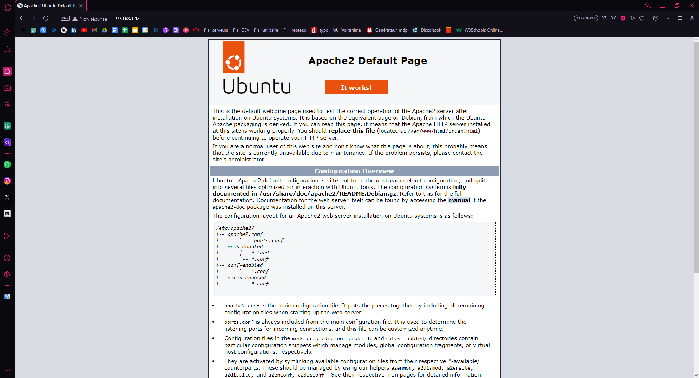
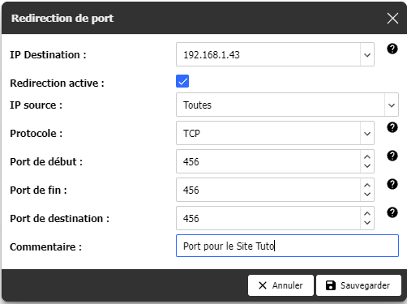

# Comment installer un serveur wab sur ubuntu server ([Apache2](https://doc.ubuntu-fr.org/apache2)) : 

Un serveur HTTP permet à un site web de communiquer avec un navigateur en utilisant le protocole HTTP(S) et ses extensions (WebDAV, etc.). Apache est probablement le serveur HTTP le plus populaire. C'est donc lui qui met à disposition la plupart des sites Web du WWW.
Il est produit par la Apache Software Foundation. C'est un logiciel libre fourni sous la licence spécifique Apache.

On utilise généralement Apache en conjonction avec d'autres logiciels, permettant d'interpréter du code et d'accéder à des bases de données. Le cas le plus courant est celui d'un serveur LAMP (Linux Apache MySQL PHP).

## Installation d'Apache2
Avant de commencer on va mettre notre OS à jour : 
```bash
apt-get update
```
```bash
apt install apache2 -y
```
*la condition `-y' est là pour éviter la confirmation du téléchargement plus tard.*

### Votre serveur est prêt !
 
**Si** vous ne connaissez pas l'IP de la machine : 
```bash
 ip a
 ```

Dans mon cas c'est 192.168.1.43 : 



## Comment modifier votre site : 
Pour ce faire, il faut se rendre dans le dossier qui contient les fichiers du site :
```bash
cd /var/www/html
```
Puis un `ls` pour voir les fichiers, et pour éditer on utilisera `nano` :
```bash
root@web-server-temp:~# cd /var/www/html
root@web-server-temp:/var/www/html# ls
index.html
root@web-server-temp:/var/www/html# nano index.html
```


Vous pouvez coder votre site depuis la console, mais c'est mieux d'importer vos fichiers que vous avez codés depuis un IDE avec un logiciel de SFTP (SSH File Transfer Protocol).

Je conseille [WinSCP](https://winscp.net/eng/download.php), après les autres marches très bien comme [FileZilla](https://filezilla-project.org).

Ce sont des clients SFTP (SSH File Transfer Protocol) donc il faut autoriser le SSH via le port 22 si ce n'est pas déjà fait et vous connecter avec le compte root.

**SI** le SSH n'est pas autoriser : 
Pour télécharger SSH ou le mettre à jour :
```bash
apt install ssh -y
```
Autoriser le SSH
```bash
sudo nano /etc/ssh/sshd_config
```
décoomentez : 
```bash
port 22
PermitRootLogin yes
```
Exemple dans le dossier "exemple"

## **OPTIONEL** Ouvrir un port de votre routeur pour que le site soit consultable depuis l'exterieur : 

Changer le port  par défaut : 
```bash
sudo nano /etc/apache2/sites-available/000-default.conf
```
Et changer le port 80 en port de votre choix, le miens c'est 456.

On va maintenant ouvrir le port depuis Ubuntu Server : 
```bash
sudo ufw allow 456
```


### Sur le routeur
celon le routeur c'est une prosedure differente qu'il faudra effectuer, ici on va le faire sur une FreeBox.

Autres box/routeur : 
- [Orange](https://pratiquepc.fr/ouvrir-des-ports-sur-une-livebox/)
- [SFR](https://fluxdeconnaissances.com/information/page/read/40568-comment-ouvrir-les-ports-de-ma-sfr-box)
- [Bouygues](https://pratiquepc.fr/ouvrir-des-ports-sur-une-bbox/)
- [TP-Link](https://www.tp-link.com/fr/support/faq/134/#:~:text=Cliquez%20sur%20Avancé->%20NAT->%20Serveurs%20virtuels%20à%20gauche.&text=Tapez%20Nom%20%2C%20le%20port%20externe,interne%20et%20cliquez%20sur%20Activer%20.)
- [Ubiquiti](https://help.ui.com/hc/en-us/articles/235723207-UniFi-Gateway-Port-Forwarding)

Rendez vous sur le site de la box généralement le http://192.168.1.254
Allez dans `Paramètre de la box` puis dans le `mode avancé` ensuite `Gestion des ports` et pour finir `Ajouter une redirection` :



Pour vous  rentre sur le site que vous venez de crée depuis l'exterieur vous devez simplement rentrer votre IP public suivi du port que vous avez ouvert.

Ex : http://100.100.100.100:456

### Vous avez fini !

## Commande a connaitre pour apache2 : 
- Pour arrêter apache2 : `sudo systemctl stop apache2`
- Pour lancer apache2 : `sudo systemctl start apache2`
- Pour relancer apache2 : `sudo systemctl restart apache2`
- Pour recharger la configuration d'apache2 : `sudo systemctl reload apache2`
- Pour voir la version d'Apache utilisée : `sudo apache2ctl -v ou a2query -v`
- Pour tester l'ensemble de la configuration d'Apache : `sudo apache2ctl -t`
- Pour lister les hôtes virtuels chargés : `a2query -s`
- Pour lister les hôtes virtuels chargés et leurs configurations : `sudo apache2ctl -S`
- Pour tester la configuration des hôtes virtuels : `sudo apache2ctl -t -D DUMP_VHOSTS`
- Pour voir les modules d'Apache chargés : `sudo apache2ctl -M ou a2query -m`


## Auteur

[](https://github.com/Teo-Gojkovic)
